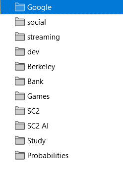
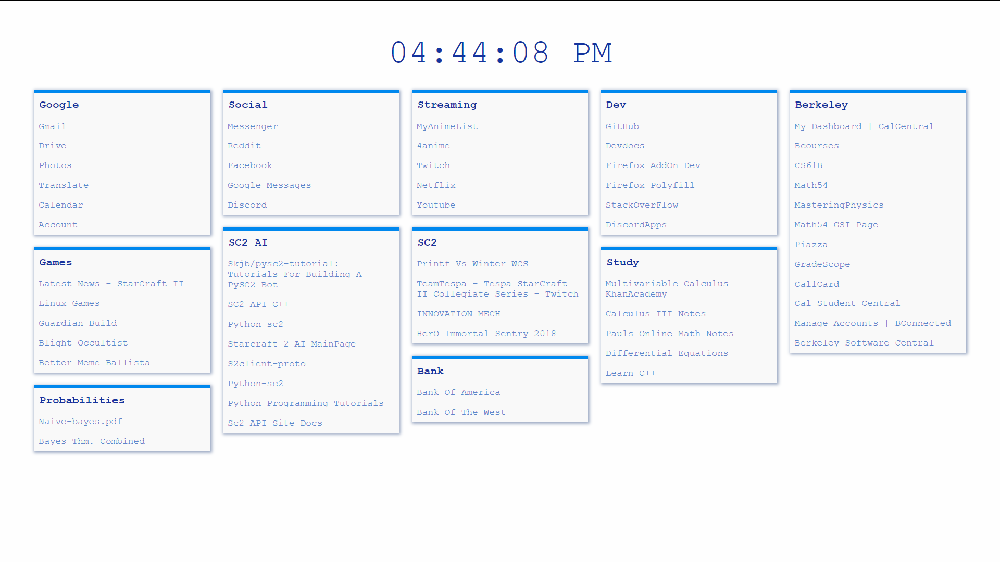
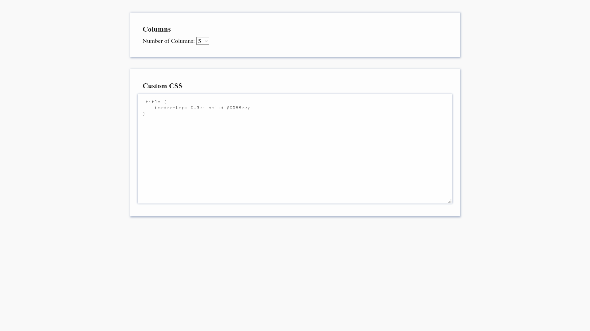

# StartPage
A Firefox extension that converts the links you have in bookmarks to clickable elements in your homepage. Changes your homepage and new tabs page to be more visually appealing, minimalistic, and useful. 

## ScreenShots
Bookmarks

StartPage

Settings

## Contributors
Derick Tseng (derickboss1@gmail.com)